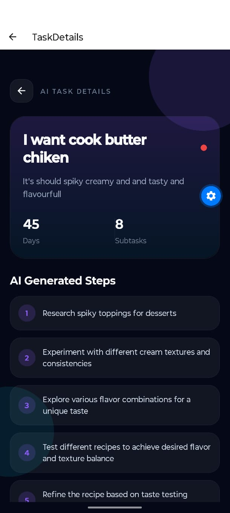
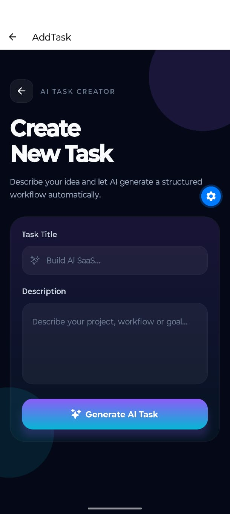

# AI Task Manager

A futuristic full-stack AI-powered productivity and life planning application built using React Native, Node.js, MongoDB, and OpenRouter AI.

This application helps users generate intelligent execution roadmaps for:
- Software projects
- Startup ideas
- Fitness goals
- Career planning
- Productivity systems
- Real-life task management
- AI workflows

---

# Features

## AI-Powered Task Planning

Generate detailed execution roadmaps using AI.

The system intelligently creates:
- Actionable subtasks
- Priority analysis
- Timeline estimation
- Recommended tools/resources

---

## Authentication System

Secure JWT-based authentication system with:
- User Registration
- Login
- Protected Routes
- Persistent Sessions

---

## Futuristic UI

Modern cinematic user interface inspired by:
- Linear
- Notion AI
- Tesla UI
- Arc Browser
- AI operating systems

Features:
- Glassmorphism
- Neon gradients
- Dark futuristic theme
- Responsive layouts

---

## Task Management

Users can:
- Create AI tasks
- Track completion
- Mark tasks completed/pending
- Delete tasks
- View detailed AI-generated execution steps

---

# Tech Stack

## Frontend
- React Native
- Expo
- React Navigation
- Expo Linear Gradient
- AsyncStorage
- React Native Safe Area Context

---

## Backend
- Node.js
- Express.js
- MongoDB Atlas
- Mongoose
- JWT Authentication
- bcrypt.js

---

## AI Integration
- OpenRouter API
- GPT Models

---

# Folder Structure

```bash
AI-Task-Manager/
│
├── backend/
│   ├── config/
│   ├── controllers/
│   ├── middleware/
│   ├── models/
│   ├── routes/
│   ├── services/
│   └── server.js
│
├── frontend/
│   ├── assets/
│   ├── components/
│   ├── navigation/
│   ├── screens/
│   ├── services/
│   └── App.js
│
└── README.md
```

---

# Installation

## Clone Repository

```bash
git clone https://github.com/chetanmurudkar60-lab/AI-Task-Manager.git
```

---

# Backend Setup

## Navigate

```bash
cd backend
```

## Install Dependencies

```bash
npm install
```

## Create `.env`

```env
PORT=5000

MONGO_URI=your_mongodb_uri

OPENROUTER_API_KEY=your_openrouter_api_key

JWT_SECRET=your_secret_key
```

## Run Backend

```bash
npm run dev
```

---

# Frontend Setup

## Navigate

```bash
cd frontend
```

## Install Dependencies

```bash
npm install
```

## Start Expo

```bash
npx expo start
```

---

# API Features

## Authentication Routes

```bash
POST /api/auth/register
POST /api/auth/login
```

---

## Task Routes

```bash
GET    /api/tasks
POST   /api/tasks
PUT    /api/tasks/:id
PATCH  /api/tasks/:id/toggle
DELETE /api/tasks/:id
```

---

# Example AI Output

```json
{
  "subtasks": [
    "Design scalable MERN architecture",
    "Implement JWT authentication",
    "Develop React Native frontend",
    "Integrate AI recommendation engine",
    "Configure cloud deployment",
    "Optimize API performance"
  ],
  "priority": "HIGH",
  "timeline": 30,
  "tools": [
    "React Native",
    "Node.js",
    "MongoDB Atlas",
    "OpenRouter AI",
    "Firebase"
  ]
}
```

---

# Future Enhancements

- AI Calendar Planning
- Push Notifications
- Team Collaboration
- Voice Assistant
- AI Productivity Analytics
- Cloud Deployment
- AI Memory System
- Habit Tracking
- Finance Planning
- Smart Scheduling

---

# Security

Sensitive credentials are protected using:
- `.env`
- `.gitignore`

No API keys are exposed publicly.

---

# Author

## Chetan Murudkar

AI & Full Stack Developer

GitHub:
https://github.com/chetanmurudkar60-lab

---

# License

This project is licensed under the MIT License.
# App Screenshots

## Login Screen


---

## Home Dashboard



---

## Add Task Screen



---

## Task Details Screen


- Download link: https://expo.dev/artifacts/eas/bvuAd6qMUxqhAXhkgCyfMX.aab
- Test account: demo@test.com / demo123
- Deployment: Backend running


